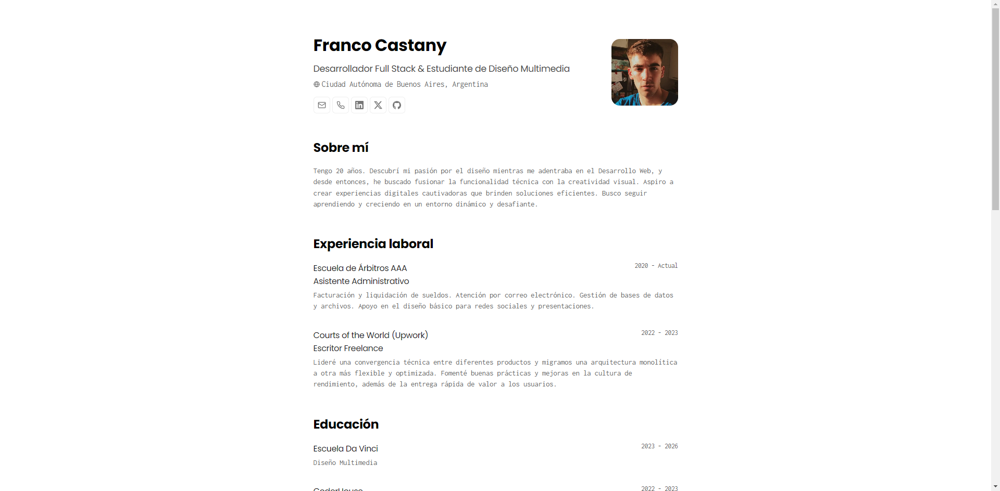

<h2>
    <strong>Franco Castany</strong>. Portfolio minimalista maquetado para web y pdf
</h2>

    Esquema del JSON de CV de <a href="https://jsonresume.org/schema/">jsonresume.org</a>

    Basado en el diseño de <a href="https://github.com/BartoszJarocki/cv">Bartosz Jarocki</a>

</img>

## 🛠️ Stack

- [**Astro**](https://astro.build/) - El framework web de la nueva época.
- [**Typescript**](https://www.typescriptlang.org/) - JavaScript con sintaxis de tipado.
- [**Ninja Keys**](https://github.com/ssleptsov/ninja-keys) - Menu desplegable con atajos de teclado hecho en puro Javascript.

## 🔑 Licencia

Basado en el diseño de [**Bartosz Jarocki**]([https://midu.dev](https://github.com/BartoszJarocki/cv)), actualizado por [**midudev**](https://midu.dev).

