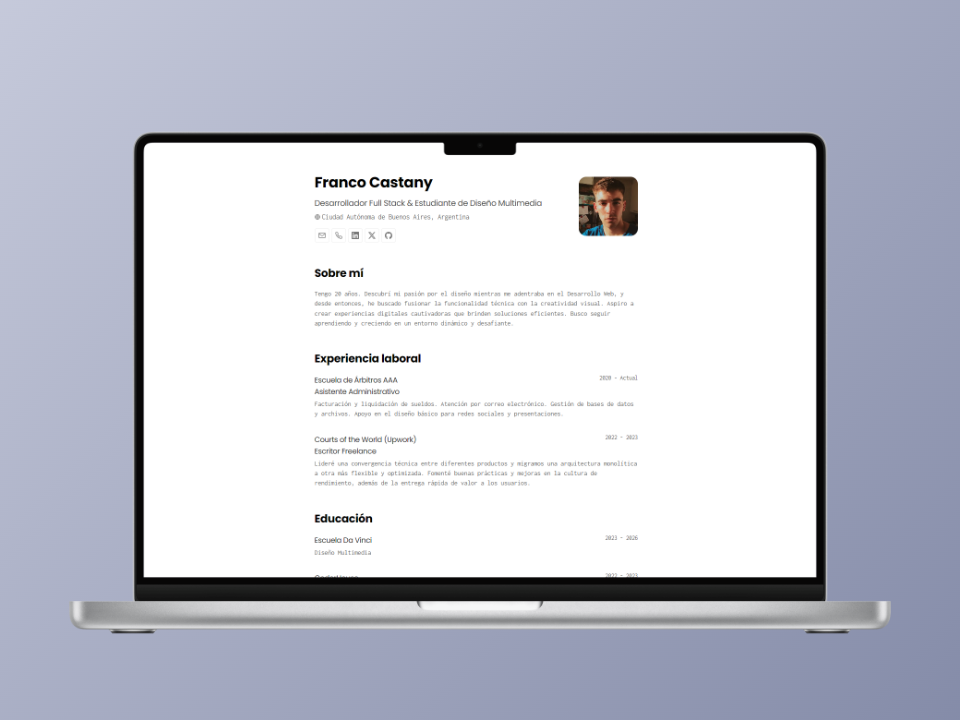

<h2>
    Minimalist <strong>Franco Castany</strong>'s portfolio for Web and PDF.
</h2>

    JSON CV Schema from <a href="https://jsonresume.org/schema/">jsonresume.org</a>

    Based on <a href="https://github.com/BartoszJarocki/cv">Bartosz Jarocki</a>'s design.

</img>

## 🛠️ Stack

- [**Astro**](https://astro.build/) - The web framework of the new era.
- [**Typescript**](https://www.typescriptlang.org/) - JavaScript with typing syntax.
- [**Ninja Keys**](https://github.com/ssleptsov/ninja-keys) - Drop-down menu with keyboard shortcuts made in pure Javascript.

## 🔑 Licencia

Based on [**Bartosz Jarocki**](<[https://midu.dev](https://github.com/BartoszJarocki/cv)>)'s design, upgraded by [**midudev**](https://midu.dev).
